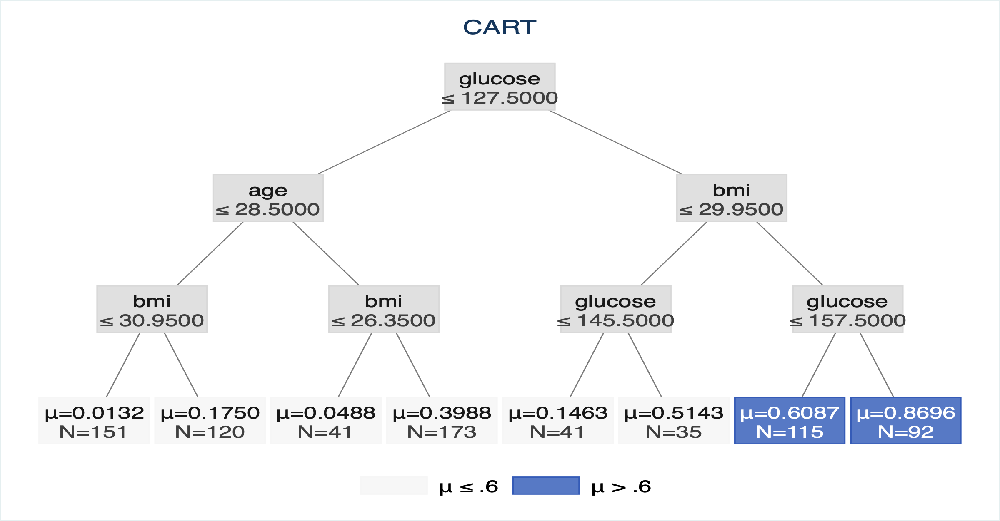
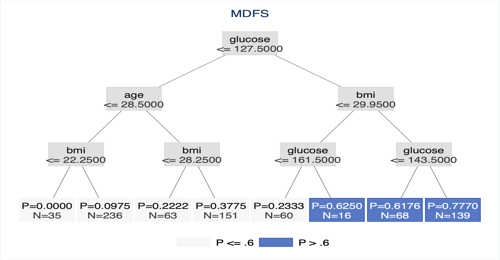
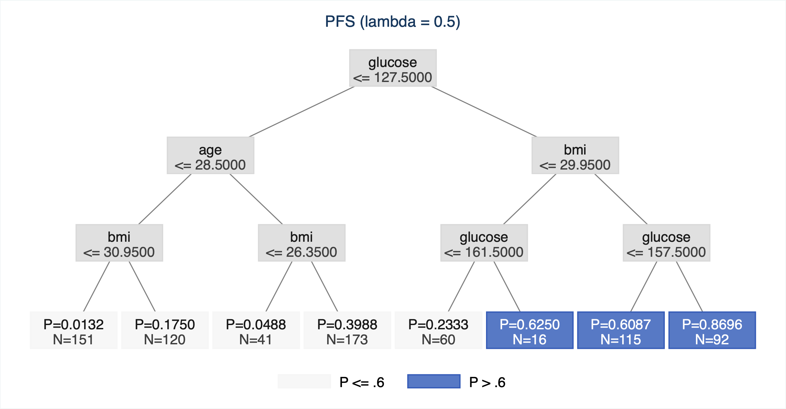
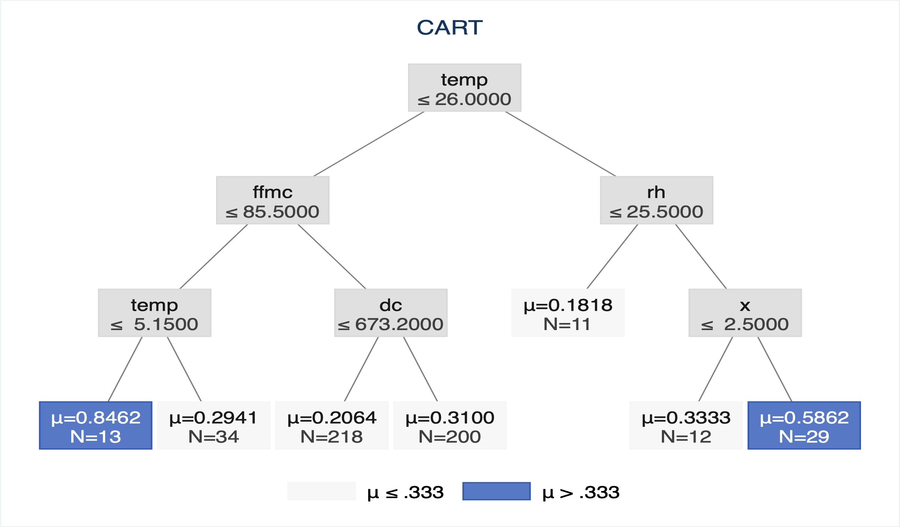
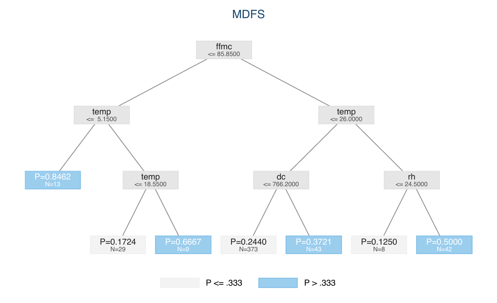
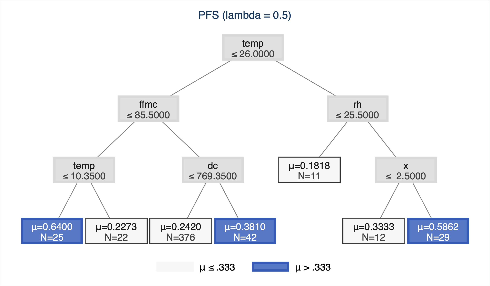

# targetree for Stata

`targetree` helps applied researchers construct interpretable targeting rules
for binary outcomes. For example, it can identify groups whose estimated risk
of hospital closure, loan denial, financial distress, or another adverse event
exceeds a policy threshold chosen by the researcher.

The package fits classification trees using CART, Penalized Final Split (PFS),
or Maximum Distance Final Split (MDFS). It reports predicted risks and
targeting classifications, evaluates the resulting policy, and draws a tree
diagram that can be saved for papers or presentations. It requires Stata 16 or
newer and does not require Python or any community-contributed Stata package.

## Installation

Copy this command into Stata's Command window:

```stata
net install targetree, from("https://raw.githubusercontent.com/Bill-Wang-Metrics/targetree-stata/main") replace
```

Then open the package documentation:

```stata
help targetree
```

To update the package later, run the same `net install` command again with the
`replace` option.

## Quick start

The example below creates a binary outcome named `closed`, fits an MDFS tree,
and evaluates and plots the resulting targeting policy:

```stata
clear
set seed 42
set obs 500

generate double x1 = rnormal()
generate double x2 = rnormal()
generate double true_p = invlogit(x1 + x2)
generate byte closed = runiform() < true_p

targetree closed x1 x2, depth(4) minimum_portion(.05) method(mdfs) cut(.30)

predict double closure_risk
predict byte targeted, class
targetree_risk closed
targetree_print
targetree_plot, title("MDFS tree") font_size(medsmall) split_rule_lines(2)
```

Here, `cut(.30)` targets terminal groups with an estimated outcome probability
above 0.30. `depth(4)` sets the maximum tree depth, while
`minimum_portion(.05)` requires every terminal group to contain at least 5% of
the estimation sample.

The one-line model command can be pasted directly into Stata's Command window.
Examples that use `///` for line continuation must be run together from the
Do-file Editor; do not submit their lines separately in the Command window.

## Methods

| `method()` | Default `lbd()` | Description |
|---|---:|---|
| `cart` | 0 | Standard CART splitting; the targeting threshold is applied after the tree is fitted |
| `pfs` | 0 | A threshold-focused final split with a researcher-selected weight, `lbd()` |
| `mdfs` | 1 | A fully threshold-focused final split |


## Tree output

```stata
targetree_print
targetree_plot, saving("tree.gph") replace
```

`targetree_plot` saves Stata `.gph` files natively. It can also export formats
supported by the local Stata installation, such as PNG, PDF, or SVG. Plot size
is selected automatically from the tree, or can be overridden with
`xsize()` and `ysize()`. The default node boxes and graph dimensions provide
more room for labels, and targeted leaves use a dark blue fill with white text
for clear contrast. Every node has a dark, visible frame so that light boxes
remain distinct after resizing or printing, and the legend keys retain the
same framed appearance. Use `font_size()` to set one
uniform Stata text size for all node labels and the legend; the default is
`medsmall`. Use
`split_rule_lines(1)` to keep each internal-node rule on one line or
`split_rule_lines(2)` to place the variable name and condition on separate
lines. Numerical rules use the mathematical symbol `≤`, and terminal nodes
report their mean as `μ`. For example:

```stata
targetree_plot, font_size(medsmall) split_rule_lines(2) saving("tree.pdf") replace
```

The `minimum_portion()` option is a terminal-node constraint: every terminal
node contains at least `ceil(minimum_portion * e(N))` observations.

Run `help targetree` in Stata for full command documentation.

## Worked examples

The installation includes diabetes and forest-fire datasets and complete
example scripts. They use the same outcomes, predictors, thresholds, depths,
and minimum-node settings as the corresponding Python examples.

### Diabetes

This example uses the 768-observation Pima Indians diabetes data, sets
`Outcome` as the binary target, and uses `cut = 0.60` with depth 3. The PFS
model uses `lbd(.5)`, matching `lbd=0.5` in the Python notebook.

Run the complete example after installing `targetree`:

```stata
findfile targetree_diabetes_example.do
do "`r(fn)'"
```

The individual CART, MDFS, and PFS commands are shown below.

```stata
findfile targetree_diabetes.dta
use "`r(fn)'", clear
targetree outcome pregnancies glucose bloodpressure skinthickness insulin bmi diabetespedigreefunction age, depth(3) minimum_portion(.02) method(cart) cut(.60)
targetree_risk outcome
targetree_plot, title("CART") name(diabetes_cart) font_size(medsmall) split_rule_lines(2)
targetree outcome pregnancies glucose bloodpressure skinthickness insulin bmi diabetespedigreefunction age, depth(3) minimum_portion(.02) method(mdfs) cut(.60)
targetree_risk outcome
targetree_plot, title("MDFS") name(diabetes_mdfs) font_size(medsmall) split_rule_lines(2)
targetree outcome pregnancies glucose bloodpressure skinthickness insulin bmi diabetespedigreefunction age, depth(3) minimum_portion(.02) method(pfs) lbd(.5) cut(.60)
targetree_risk outcome
targetree_plot, title("PFS (lambda = 0.5)") name(diabetes_pfs) font_size(medsmall) split_rule_lines(2)
```

The complete runnable script is
[`targetree_diabetes_example.do`](targetree_diabetes_example.do).

Diabetes CART tree:



Diabetes MDFS tree:



Diabetes PFS tree (`lbd = 0.5`):



### Forest fires

This example uses the 517-observation forest-fires data, defines the target as
`area > 5`, and uses `cut = 1/3` with depth 3. As above, PFS uses
`lbd(.5)`.

Run the complete example after installing `targetree`:

```stata
findfile targetree_forestfires_example.do
do "`r(fn)'"
```

The individual CART, MDFS, and PFS commands are shown below.

```stata
findfile targetree_forestfires.dta
use "`r(fn)'", clear
generate byte fire_above_5 = area > 5
targetree fire_above_5 x y ffmc dmc dc isi temp rh wind rain, depth(3) minimum_portion(.02) method(cart) cut(.3333333333)
targetree_risk fire_above_5
targetree_plot, title("CART") name(forestfires_cart) font_size(medsmall) split_rule_lines(2)
targetree fire_above_5 x y ffmc dmc dc isi temp rh wind rain, depth(3) minimum_portion(.02) method(mdfs) cut(.3333333333)
targetree_risk fire_above_5
targetree_plot, title("MDFS") name(forestfires_mdfs) font_size(medsmall) split_rule_lines(2)
targetree fire_above_5 x y ffmc dmc dc isi temp rh wind rain, depth(3) minimum_portion(.02) method(pfs) lbd(.5) cut(.3333333333)
targetree_risk fire_above_5
targetree_plot, title("PFS (lambda = 0.5)") name(forestfires_pfs) font_size(medsmall) split_rule_lines(2)
```

The complete runnable script is
[`targetree_forestfires_example.do`](targetree_forestfires_example.do).

Forest-fire CART tree:



Forest-fire MDFS tree:



Forest-fire PFS tree (`lbd = 0.5`):



The confusion-matrix counts reproduce the Python reference implementation:

| Dataset | Method | TP | FN | FP | TN |
|---|---|---:|---:|---:|---:|
| Diabetes | CART | 150 | 118 | 57 | 443 |
| Diabetes | MDFS | 160 | 108 | 63 | 437 |
| Diabetes | PFS (`lbd=.5`) | 160 | 108 | 63 | 437 |
| Forest fires | CART | 28 | 123 | 14 | 352 |
| Forest fires | MDFS | 53 | 98 | 55 | 311 |
| Forest fires | PFS (`lbd=.5`) | 49 | 102 | 47 | 319 |

## Getting help

Use `help targetree` for the model syntax and links to prediction, evaluation,
printing, honest estimation, and plotting commands. Questions and bug reports
can be submitted through the repository's
[Issues page](https://github.com/Bill-Wang-Metrics/targetree-stata/issues).
